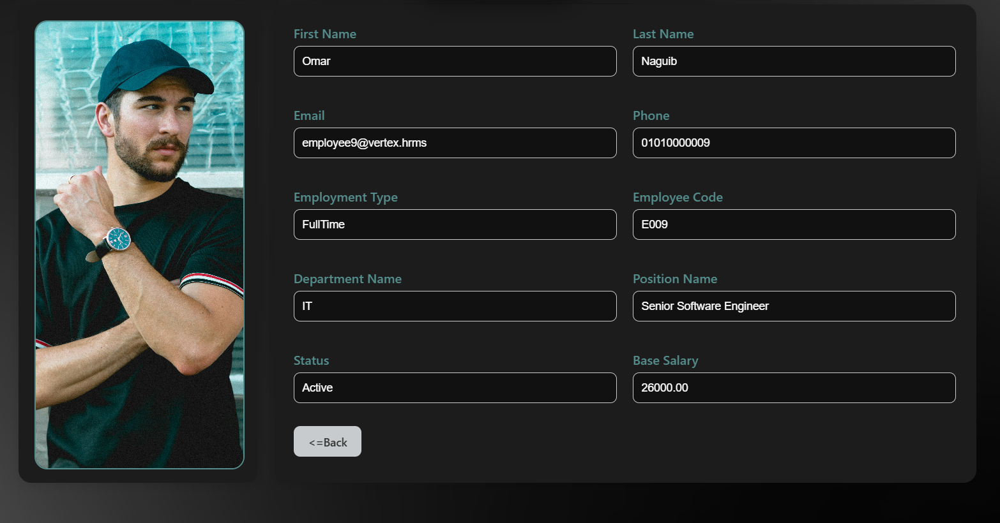
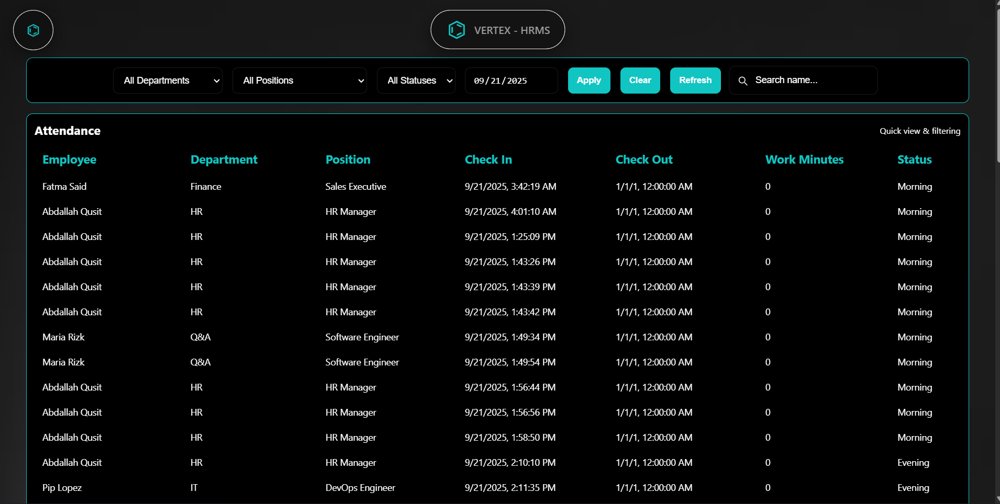
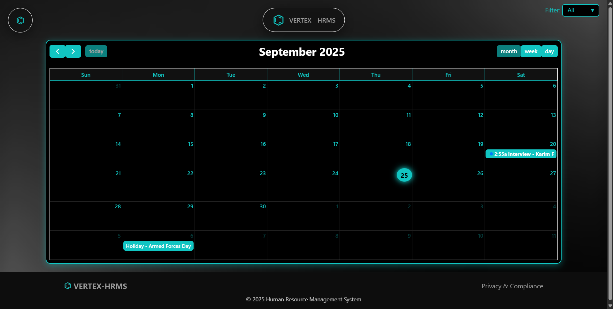
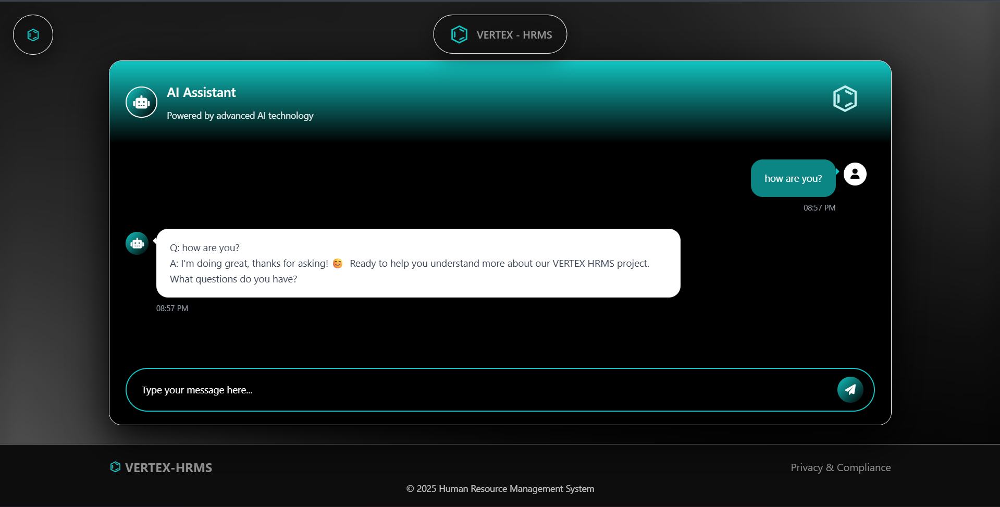

# Vertex HRMS

**Vertex HRMS** is a modern **Human Resource Management System** designed to streamline HR operations within an organization.
It provides tools for **attendance tracking, leave management, payroll processing, and HR analytics**, helping companies manage employees efficiently through a centralized web platform.

The system follows a **clean layered architecture** to ensure scalability, maintainability, and clear separation of concerns.

---

# Features

### HR Dashboard

* Real-time HR metrics and analytics
* Employee statistics and system overview
* Quick access to key HR operations

### Attendance Management

* Track employee attendance and working hours
* Integrated **face recognition module** for automated check-in and check-out
* Attendance reports and summaries

### Leave Management

* Employees can submit leave requests via email
* Automated background job processes requests
* HR managers can approve or reject requests
* Decision notifications are sent via email
* Leave requests appear in a **chat-style interface**

### Payroll System

* Manage payroll cycles
* Calculate salaries and deductions
* Payroll run management

### Notifications System

* Email notifications for leave approvals or rejections
* Real-time updates within the system

### Role-Based Access

* Different system roles (Admin / HR / Employee)
* Secure access control for system features

---

# Architecture

The system follows a **layered architecture** that separates responsibilities across multiple layers:

```
Presentation Layer
      ↓
Business Logic Layer
      ↓
Data Access Layer
      ↓
Database
```

### Benefits

* Better maintainability
* Easier testing
* Improved scalability
* Clean separation of responsibilities

---

# Tech Stack

**Backend**

* ASP.NET Core
* C#
* Entity Framework Core

**Frontend**

* HTML
* CSS
* JavaScript

**Database**

* SQL Server

**Other Technologies**

* Face Recognition integration
* Email services
* Background job processing

---

# Project Structure

```
Vertex-HRMS
│
├── Presentation Layer
│   └── Controllers / Views / UI Components
│
├── Business Logic Layer
│   └── Services / Application Logic
│
├── Data Access Layer
│   └── Repositories / Database Context
│
├── Models
│   └── Entities and DTOs
│
└── Utilities
    └── Helper classes and shared components
```

---

# Installation

### 1 Clone the repository

```bash
git clone https://github.com/Abdallah-Qusit/Vertex-HRMS.git
cd Vertex-HRMS
```

### 2 Configure the database

Update the connection string in:

```
appsettings.json
```

### 3 Apply migrations

```bash
dotnet ef database update
```

### 4 Run the project

```bash
dotnet run
```

The application will start on:

```
https://localhost:xxxx
```

---

# Screenshots

### Employee Profile & Attendance

<p align="center">
  
  
</p>

### Calendar & AI Chat

<p align="center">
  
  
</p>

---

# Author

**Abdallah Qusit**

* GitHub:
  [https://github.com/Abdallah-Qusit](https://github.com/Abdallah-Qusit)

---
